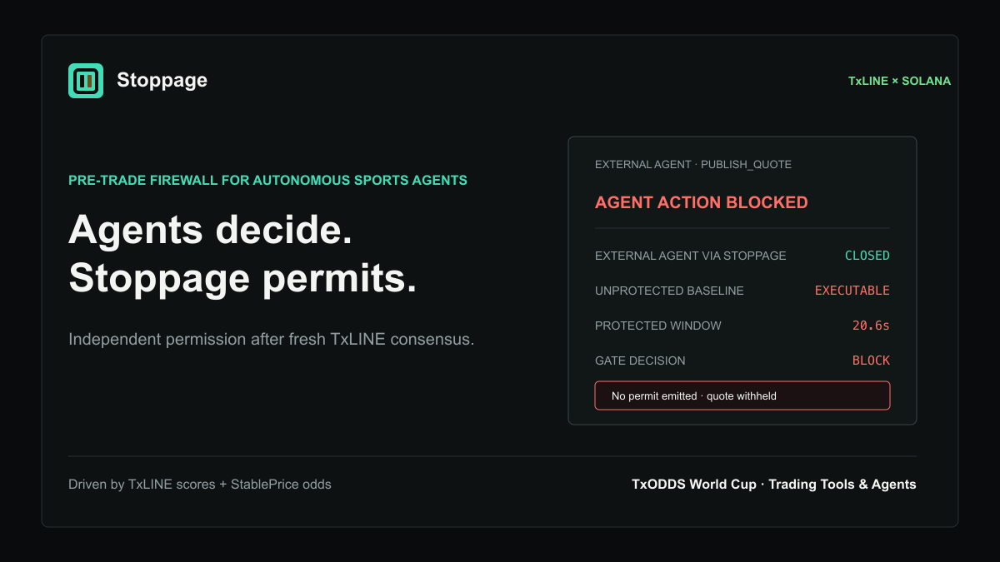

# Stoppage



**An autonomous in-play quote governor driven by TxLINE on Solana.**

Live judge console: <https://stoppage-txline.vercel.app>

Stoppage freezes, reprices, and reopens a simulated operator book when the
match-event stream and the StablePrice market stream disagree. It is operator
risk tooling, not a wagering product: there is no custody, bet placement, or
claim of executable bookmaker fills.

## Product loop

```text
TxLINE scores ─┐
               ├─> deterministic policy ─> SUSPEND ─> REPRICE ─> REOPEN
TxLINE odds ───┘                └─────────> FAILSAFE on stream degradation
```

The MVP controls one market deeply: in-running soccer `1X2`. Every transition
emits a canonical JSON receipt bound to the policy configuration by SHA-256.
The sponsor-specific proof path is live: a confirmed score stat was checked
through TxODDS's official Solana mainnet `validateStat` instruction.

## Current status

- Deterministic quote governor: implemented and tested.
- Event-first, odds-first, and stream-failure paths: implemented and tested.
- Zero-friction public judge replay: implemented with a **synthetic normalized
  fixture**, visibly labeled in the application.
- TxLINE service-level-12 subscription and API activation: confirmed on Solana
  mainnet.
- Dual-stream transport gate: mainnet fixtures, odds, and scores were observed
  together through the full private runtime gate. Raw transport records remain
  private under the event data licence.
- Private historical gate: three captured fixtures each produced at least one
  complete `SUSPEND -> REPRICE -> REOPEN` lifecycle. Raw TxLINE records and
  real-match vectors remain private under the event data licence.
- TxLINE on-chain score validation: confirmed on Solana mainnet with a true
  predicate result.
- Public real-match metrics: human-approved and available through
  `/api/public-claim`. The endpoint exposes only derived holdout aggregates,
  lifecycle decisions, and public Solana evidence; raw fixture IDs and source
  vectors remain private.

## Mainnet evidence

| Proof                         | Public evidence                                                                                                                 |
| ----------------------------- | ------------------------------------------------------------------------------------------------------------------------------- |
| TxLINE program                | [`9Exb...cKaA`](https://solscan.io/account/9ExbZjAapQww1vfcisDmrngPinHTEfpjYRWMunJgcKaA)                                        |
| Free-tier subscription        | [`27b1...KP3T`](https://solscan.io/tx/27b1KoYCrWD9MkZY86rkUpJmWzqyRjHmi5hC8CNMwA81jr8QBVmR7diYy6tWE3LLfXA3KfLCzZsStGkG7YZWKP3T) |
| TxLINE `validateStat` success | [`3ZEu...XwPd`](https://solscan.io/tx/3ZEuF4zPtGiwT5iMwHQnPMWpX9U8BsMz1aHybwyzmkjaoMKmCNVQ4eADQtAB11rNwyb1EtDLadn9qQeGZzuXXwPd) |

The validation transaction is the sponsor-specific proof. Stoppage decision
hashes remain supporting evidence rather than the product's main action.

## Run locally

Prerequisites: Node.js 22+ and pnpm 10+.

```bash
pnpm install
pnpm check
pnpm start
```

Open `http://localhost:4173`. The replay requires no wallet, token, or login.

For development:

```bash
pnpm dev
```

## Mainnet integration

Stoppage uses the TxLINE mainnet deployment:

| Item                | Value                                            |
| ------------------- | ------------------------------------------------ |
| Network             | Solana mainnet                                   |
| TxLINE program      | `9ExbZjAapQww1vfcisDmrngPinHTEfpjYRWMunJgcKaA`   |
| Free real-time tier | Service level `12`                               |
| API origin          | `https://txline.txodds.com`                      |
| Odds stream         | `/api/odds/stream`                               |
| Scores stream       | `/api/scores/stream`                             |
| Historical scores   | `/api/scores/historical/{fixtureId}`             |
| Historical odds     | `/api/odds/updates/{epochDay}/{hour}/{interval}` |
| Score proof         | `/api/scores/stat-validation`                    |
| Public claim        | `/api/public-claim`                              |

The setup scripts deliberately separate wallet operations from the server:

```bash
pnpm wallet:create
pnpm txline:inspect
pnpm txline:activate
pnpm g1:probe
pnpm worker:live
```

`txline:activate` refuses non-mainnet hosts, non-level-12 subscriptions, and
wallets without enough SOL for Token-2022 account rent and transaction fees.
Secrets are written only to ignored files with restrictive permissions.

`worker:live` supervises both SSE streams, records raw payloads only under the
ignored private capture directory, reconnects with bounded backoff, emits
stream-health inputs into the same governor, and persists only derived decision
receipts separately. It also refreshes the fixture catalog every five minutes so
new knockout fixtures become eligible without a restart.

For a container host, the compiled worker runs without development dependencies:

```bash
docker compose --profile live up -d --build
curl http://localhost:4173/api/worker-health
```

The live profile keeps raw captures and runtime state in separate persistent
volumes. The health endpoint exposes only derived counters, stream state, and
message age; it never returns credentials, source identifiers, or feed records.

## Policy

Stoppage is a deterministic state machine. No LLM participates in quote
decisions.

- `EVENT_BEFORE_REPRICE`: a goal, red card, penalty, or VAR signal arrives while
  the last quote predates it. An unconfirmed signal suspends immediately, but
  confirmation or explicit discard is required before reopening.
- `UNBACKED_MOVE`: a configured probability jump arrives without a supporting
  high-impact event inside the confirmation window.
- `STREAM_UNHEALTHY`: either required feed misses its health policy.
- `REPRICE`: the consensus vector remains inside the configured epsilon for the
  required number of consecutive updates.
- `REOPEN`: all pending incidents are confirmed or discarded and the
  post-reprice delay passes without renewed instability.

The thresholds shown in the repository were frozen after chronological
calibration and approved before holdout evaluation. Public aggregates are
exposed only via `/api/public-claim` after a separate human publication approval
that binds both the approved config hash and the exact candidate digest. The
holdout and lifecycle evidence must share that approved config hash.

## Metrics

Stoppage does not report hypothetical betting profit or in-play CLV.

- `stale_quote_seconds`: time the baseline remains open while the governed book
  is unavailable.
- `mispricing_integral`: probability divergence multiplied by time, evaluated
  against the first post-trigger quote satisfying the frozen stability rule.
- suspension and reopen latency.
- unconfirmed odds-led suspension rate: odds-led windows that remained
  `UNBACKED_MOVE` through repricing divided by all odds-led windows; `null` means
  no odds-led case was observed, not that event-led windows failed to complete.
- fixed-horizon repricing error.
- stream uptime and failover count.

The stable reference is used only after the lifecycle for evaluation. It is
never available to the live decision path.

## Data boundary

Raw TxLINE payloads, odds vectors, score records, identifiers, and credentials
are private runtime material. They are not committed or returned by the public
API. The public application exposes synthetic judge inputs plus Stoppage-derived
state transitions, approved aggregate metrics, hashes, and public Solana proof
transactions from `/api/public-claim`. Private captures are purged when the
hackathon data licence terminates.

See [architecture](docs/ARCHITECTURE.md), [rulebook](docs/RULEBOOK.md),
[mainnet setup](docs/MAINNET_SETUP.md), and [data policy](docs/DATA_POLICY.md).

## Verification

```bash
pnpm check
```

This runs formatting checks, TypeScript checks, domain and integration tests,
and a production build.

## License

MIT. The vendored TxODDS IDL remains subject to its upstream ISC licence; see
[third-party notices](THIRD_PARTY_NOTICES.md).
